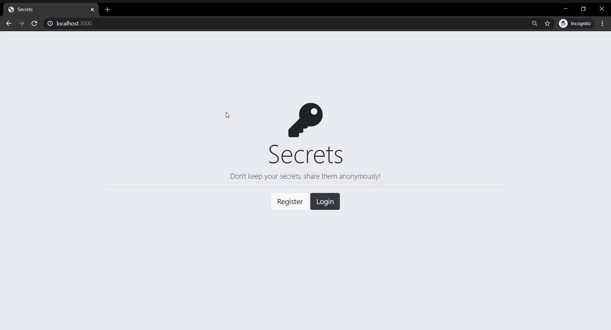

# Secrets
Social Networking site to share secrets anonymously. It has Google authentication setup for login along with standard username and password. Posts are saved using Mongo DB.

## Demo-


## Tech Stack-
- HTML
- CSS
- EJS template engine
- Node JS
- Mongo DB

## Dependencies-
- Express
- Passport
- Passport Google OAuth2
- Mongoose

## Environment Setup-

* Drop a :star: on the GitHub repository.
<br/>

* Download and install a code/ text editor.
    - Recommended-
        - [Download VS Code](https://code.visualstudio.com/download)
        - [Download Atom](https://atom.io/)
<br/>

* Download [Node Js and npm(Node package manager)](https://nodejs.org/en/) (when you download Node, npm also gets installed by default)
<br/>

* Mongo DB community editition is free and a great software in order to work with MongoDB applications. [Download Mongo DB community editition](https://docs.mongodb.com/manual/administration/install-community/)
<br/>

* Robo 3T is a desktop graphical user interface (GUI) for Mongo DB. It can help to skip running all the Mongo DB commands manually every time we want to access the data. [Download Robo 3T](https://robomongo.org/download) **(optional)**
<br/>

* Clone the repository by running command
```
https://github.com/Pranav016/Secrets.git
```
in your git bash.
<br/>

* Run command `cd Secrets`.
<br/>

* Run this command to install all dependencies for the project.
```
npm install
```
<br/>

* Run this command on your terminal/ bash to start the Mongo server on port 27017(default).
```
mongod
```
<br/>

* Run this command to start the project on local host 3000.
```
npm start
```
<br/>

* Open link to view the website in your browser window if it doesn't open automatically.
```
http://localhost:3000/
```
<br/>

* You can learn more about EJS template engine and its syntax to know how we can use it inside our HTML using the [documentation](https://ejs.co/#docs)
<br/>

* Now you are all set to use this project.

#### Some useful Mongo DB commands if you are using the terminal instead of the GUI-
```
show dbs
use db <db name>
show collections
<db name> .find()
```
